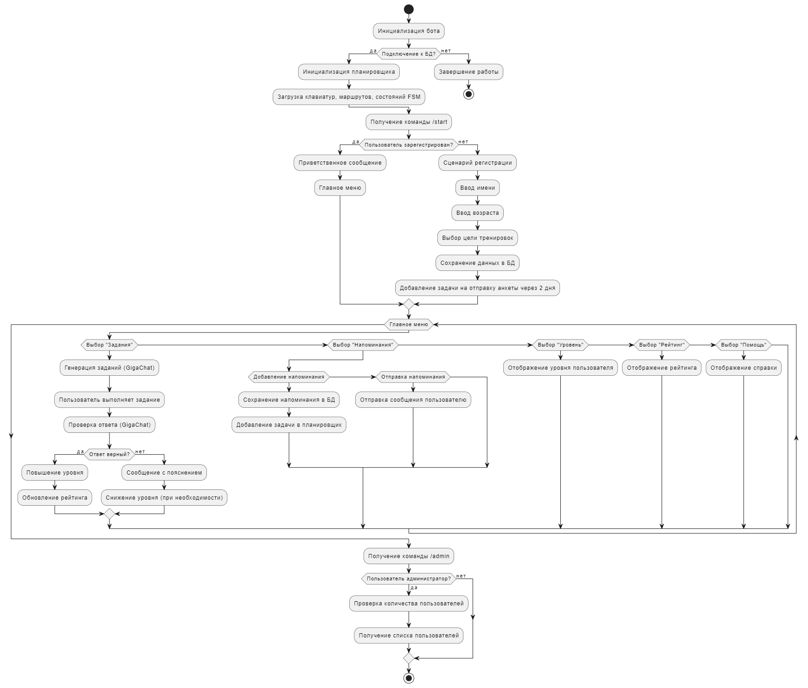
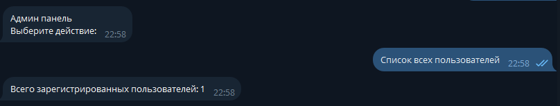
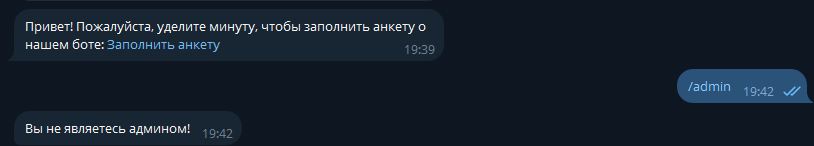
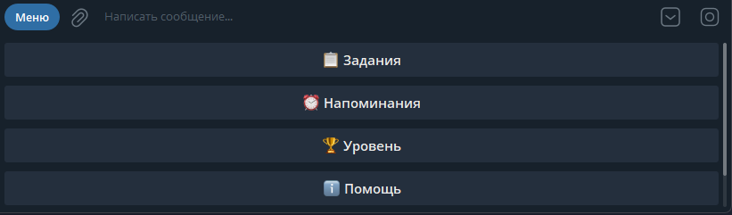
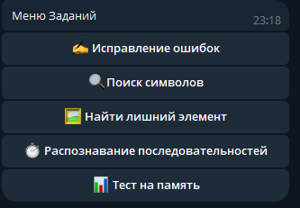
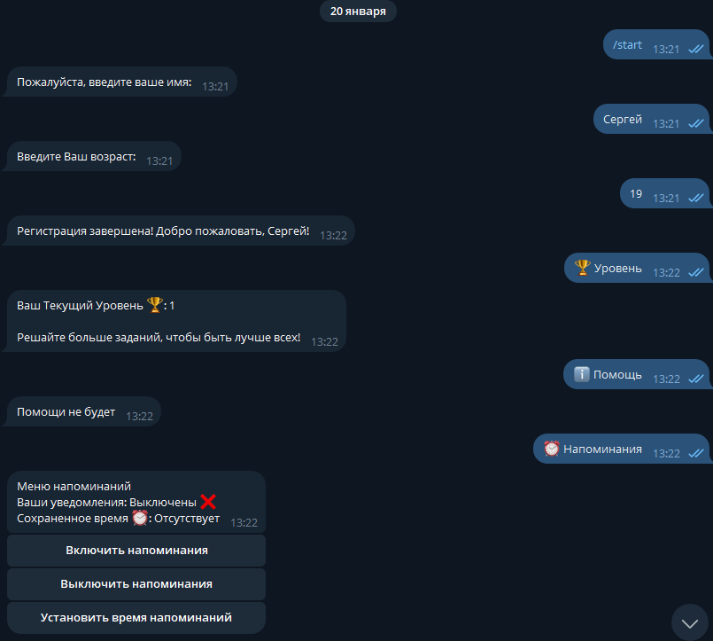
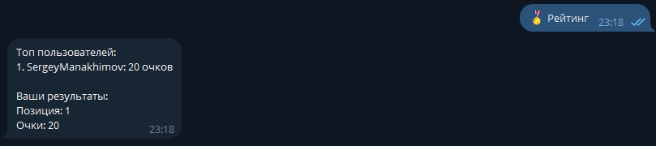
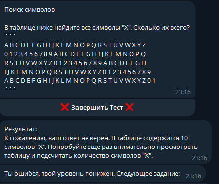

# AI Bot

## Разработчики из группы БИВ238

- Манахимов Сергей Анатольевич
- Гилядов Борис Равашиевич

## Описание

AI Bot — это Telegram-бот для тренировки внимания, предназначенный для:

- Генерации и проверки заданий на внимание с помощью GigaChat.
- Напоминаний пользователям об их активностях.
- Управления заданиями и системой рейтинга.
- Регистрации пользователей и сохранения их целей тренировок.

## Реализованные требования к интерфейсу

Мы успешно реализовали следующие требования к интерфейсу:

- Русский язык.
- Наличие командного меню ("/menu").
- Наличие inline и обычных клавиатур.
- Реакция/ответ бота на любое действие пользователя.
- Проверка корректности ввода данных пользователем.

## Реализованный функционал

Мы полностью реализовали следующий функционал:

- Ввод регистрационных данных пользователем.
- Заполнение пользователем анкеты при регистрации (FSM).
- Проверка зарегистрированности пользователя при вызове команд (Middleware).
- Запись действий пользователя в БД (Middleware). Вместо БД можно использовать csv-файл с разделителями или Excel-файл с несколькими столбцами.
- Напоминания или периодические сообщения (библиотека Apsheduler).
- Заполнение анкеты пользователем по окончании использования или спустя какое-то время, после начала использования (FSM).
- Использование LangChain (память, промпты, цепочки).
- Разграничение использования памяти между разными пользователями.

## Функционал бота

### Меню

- Команда `/menu` — отображает главное меню с доступными действиями.
- Поддерживает кнопки:
  - "📋 Задания" — доступ к заданиям.
  - "⏰ Напоминания" — управление напоминаниями.
  - "🏆 Уровень" — просмотр текущего уровня пользователя.
  - "🏅 Рейтинг" — отображение рейтинга пользователей.
  - "ℹ️ Помощь" — информация о поддержке.

### Админ-панель

- Команда `/admin` — доступ только для администраторов.
- Функции:
  - "Список всех пользователей" — отображение общего числа зарегистрированных пользователей.

### Напоминания

- Возможность включать, отключать и изменять время ежедневных напоминаний.
- Уведомления отправляются пользователям на основе времени, установленного в базе данных.
- Отправка анкет пользователям через два дня после регистрации.

### Уровень и рейтинг

- Команда "🏆 Уровень" — отображает текущий уровень пользователя и советы по его повышению.
- Команда "🏅 Рейтинг" — отображает топ пользователей и позицию текущего пользователя в рейтинге.

### Задания

- Генерация заданий с помощью GigaChat с учетом уровня сложности пользователя.
- Категории заданий:
  - Исправление ошибок.
  - Поиск символов.
  - Найти лишний элемент.
  - Распознавание последовательностей.
  - Тест на память.
- Проверка ответов пользователей и обновление их рейтинга в зависимости от правильности.
- Возможность завершить выполнение задания в любой момент.

### Регистрация

- Команда `/start` — проверяет, зарегистрирован ли пользователь.
- Если пользователь не зарегистрирован, начинается сценарий FSM для ввода имени, возраста и выбора цели тренировок.

## Структура проекта

### Основные папки

#### `handlers`

Содержит обработчики команд и сообщений:

- `menu.py` — обработка команды "/menu" и взаимодействие с главным меню.
- `send_notification.py` — управление уведомлениями.
- `start.py` — обработка команды "/start" и регистрация новых пользователей.
- `tasks.py` — обработка заданий, управление состояниями и взаимодействие с GigaChat.

#### `helpers`

Вспомогательные модули:

- `constants.py` — константы проекта.
- `helpers_functions.py` — утилитарные функции (форматирование сообщений, работа с данными).

#### `keyboards`

Создание клавиатур для бота:

- `menu.py` — кнопки главного меню.
- `tasks.py` — кнопки для взаимодействия с заданиями.

#### `states`

Определение состояний FSM (Finite State Machine):

- `registration.py` — сценарий регистрации пользователя.
- `reminder.py` — сценарий установки напоминаний.
- `tasks.py` — сценарий работы с заданиями.

### Корневые файлы

- `bot.py` — основной файл запуска бота.
- `config.py` — конфигурация приложения.
- `database.py` — работа с базой данных (хранение пользователей, заданий и напоминаний).
- `scheduler.py` — управление планировщиком задач (напоминания и анкеты).
- `requirements.txt` — список зависимостей проекта.
- `.env` — переменные окружения (API-ключи, настройки бота).

## Блок-схема



## Примеры интерфейсов

### Админ-панель


### Анкета


### Меню


### Меню заданий


### Регистрация и напоминания


### Рейтинг


### Пример задания: Поиск символов


## Как запустить проект

1. Склонируйте репозиторий проекта.
2. Создайте и активируйте виртуальную среду:
   ```bash
   python -m venv venv
   source venv/bin/activate   # для Linux/Mac
   venv\Scripts\activate    # для Windows
   ```
3. Установите зависимости:
   ```bash
   pip install -r requirements.txt
   ```
4. Убедитесь, что в файле `.env` указаны все необходимые переменные окружения (например, API-ключи Telegram и GigaChat).
5. Запустите бота:
   ```bash
   python bot.py
   ```


### P.s можете зайти на наш гит, у нас много инетересного 
